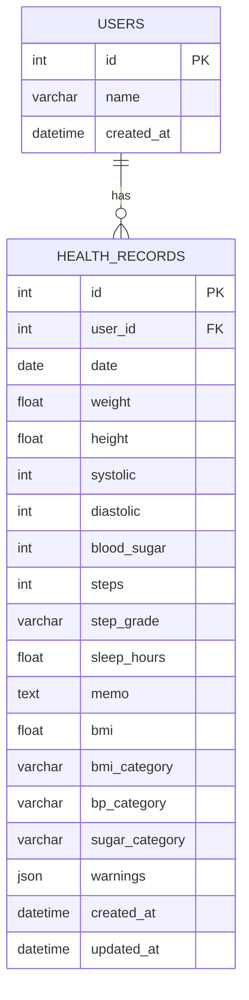

# 마이 헬스 로그 API

> 사용자의 건강 기록을 저장하고, BMI·혈압·혈당·활동량을 자동 분석하여 건강 상태와 통계를 제공하는 REST API입니다.

## 1. 프로젝트 소개

마이 헬스 로그 API는 사용자의 몸무게, 키, 혈압, 공복 혈당, 걸음 수, 수면 시간 등의 건강 기록을 PostgreSQL 데이터베이스에 저장하고 분석하는 FastAPI 기반 백엔드 프로젝트입니다.

건강 기록을 등록하면 서버가 BMI, 혈압 상태, 혈당 상태, 걸음 수 등급과 경고 메시지를 자동으로 계산합니다. 또한 날짜 범위 검색, 평균 통계, 최근 7일과 직전 7일을 비교하는 주간 리포트를 제공합니다.

> 본 프로젝트의 건강 분류 기준은 개발 학습을 위해 단순화한 기준이며 실제 의료 진단을 대신하지 않습니다.

---

## 2. 주요 기능

- 사용자 생성 및 조회
- 건강 기록 등록·조회·수정·삭제
- BMI 자동 계산 및 상태 분류
- 혈압·공복 혈당 상태 분류
- 건강 상태에 따른 경고 메시지 생성
- 걸음 수 활동 등급 분류
- 날짜 범위별 건강 기록 검색
- 평균 체중, BMI, 혈압, 혈당, 걸음 수, 수면 시간 통계
- 최근 7일과 직전 7일 비교 리포트
- PostgreSQL 데이터베이스 저장
- Docker Volume을 통한 데이터 영구 보존
- Docker Compose 기반 API·DB 통합 실행

---

## 3. 기술 스택

| 구분 | 기술 |
|---|---|
| API | FastAPI |
| 서버 | Uvicorn |
| 데이터 검증 | Pydantic |
| ORM | SQLAlchemy 2.0 |
| 데이터베이스 | PostgreSQL 17 |
| DB 드라이버 | psycopg |
| 컨테이너 | Docker, Docker Compose |
| API 문서 | Swagger UI |
| 배포 환경 | AWS Lightsail Ubuntu |
| 원격 접속 | MobaXterm |

---

## 4. 시스템 구조

```text
사용자 또는 외부 프로그램
          │
          │ HTTP 요청
          ▼
FastAPI API 서버
          │
          ├─ Pydantic 입력 검증
          ├─ BMI 및 건강 상태 계산
          └─ JSON 응답
          │
          ▼
SQLAlchemy ORM
          │
          ▼
PostgreSQL 데이터베이스
          │
          ▼
Docker Volume 데이터 영구 저장
```

Docker 실행 시 외부 `9090` 포트가 FastAPI 컨테이너의 `8000` 포트에 연결됩니다.

```text
localhost:9090 → FastAPI container:8000
FastAPI container → PostgreSQL container:5432
```

---

## 5. ERD



- 한 명의 사용자는 여러 건강 기록을 가질 수 있습니다.
- `health_records.user_id`는 `users.id`를 참조합니다.
- 사용자를 삭제하면 해당 사용자의 건강 기록도 함께 삭제됩니다.
- 주간 리포트는 별도 테이블에 저장하지 않고 건강 기록을 조회해 계산합니다.

---

## 6. API 엔드포인트

### 기본 및 상태 확인

| 메서드 | 경로 | 기능 |
|---|---|---|
| GET | `/` | API 기본 정보 |
| GET | `/health` | API 및 DB 연결 상태 확인 |

### 사용자

| 메서드 | 경로 | 기능 |
|---|---|---|
| POST | `/users` | 사용자 생성 |
| GET | `/users` | 전체 사용자 조회 |

### 건강 기록

| 메서드 | 경로 | 기능 |
|---|---|---|
| POST | `/records` | 건강 기록 저장 및 자동 분석 |
| GET | `/records` | 전체 또는 사용자별 기록 조회 |
| GET | `/records/{record_id}` | 건강 기록 단건 조회 |
| PUT | `/records/{record_id}` | 건강 기록 수정 및 재분석 |
| DELETE | `/records/{record_id}` | 건강 기록 삭제 |

### 검색·통계·리포트

| 메서드 | 경로 | 기능 |
|---|---|---|
| GET | `/search` | 날짜 범위별 기록 검색 |
| GET | `/stats` | 건강 기록 평균 통계 |
| GET | `/weekly-report` | 최근 7일과 직전 7일 비교 |

API 실행 후 Swagger UI에서 모든 기능을 테스트할 수 있습니다.

```text
http://localhost:9090/docs
```

---

## 7. 건강 분류 기준

### BMI

| BMI | 분류 |
|---:|---|
| 18.5 미만 | 저체중 |
| 18.5 이상 23 미만 | 정상 |
| 23 이상 25 미만 | 과체중 |
| 25 이상 | 비만 |

### 혈압

| 기준 | 분류 |
|---|---|
| 수축기 120 미만이고 이완기 80 미만 | 정상 |
| 수축기 120~139 또는 이완기 80~89 | 주의 |
| 수축기 140 이상 또는 이완기 90 이상 | 고혈압 |

### 공복 혈당

| 공복 혈당 | 분류 |
|---:|---|
| 100 미만 | 정상 |
| 100~125 | 공복혈당장애 |
| 126 이상 | 당뇨 의심 |

### 걸음 수

| 걸음 수 | 활동 등급 |
|---:|---|
| 5,000보 미만 | 부족 |
| 5,000보 이상 10,000보 미만 | 적정 |
| 10,000보 이상 | 우수 |

걸음 수 분류는 프로젝트에서 단순화하여 정의한 기준입니다.

---

## 8. 로컬 Docker 실행 방법

### 사전 요구사항

- Git
- Docker Desktop
- Docker Compose

### 저장소 복제

```bash
git clone <GitHub 저장소 URL>
cd my-health-log-api
```

### 환경변수 생성

`.env.example`을 복사하여 `.env` 파일을 만듭니다.

Windows PowerShell:

```powershell
Copy-Item .env.example .env
```

Linux 또는 macOS:

```bash
cp .env.example .env
```

`.env`의 DB 비밀번호를 원하는 값으로 변경합니다.

### 컨테이너 실행

```bash
docker compose up -d --build
```

### 실행 상태 확인

```bash
docker compose ps
```

### API 접속

```text
http://localhost:9090/docs
```

### 로그 확인

```bash
docker compose logs -f api
```

### 컨테이너 종료

```bash
docker compose down
```

`docker compose down -v`를 실행하면 PostgreSQL 데이터 Volume까지 삭제되므로 주의해야 합니다.

---

## 9. 로컬 Python 실행 방법

PostgreSQL 컨테이너만 실행합니다.

```bash
docker compose up -d db
```

가상환경을 생성하고 활성화합니다.

Windows PowerShell:

```powershell
python -m venv venv
.\venv\Scripts\Activate.ps1
```

패키지를 설치합니다.

```powershell
pip install -r requirements.txt
```

서버를 실행합니다.

```powershell
python -m uvicorn app.main:app --reload
```

접속 주소:

```text
http://127.0.0.1:8000/docs
```

---

## 10. 프로젝트 구조

```text
my-health-log-api/
├─ app/
│  ├─ __init__.py
│  ├─ main.py
│  ├─ database.py
│  ├─ models.py
│  ├─ schemas.py
│  ├─ crud.py
│  └─ health_service.py
├─ docs/
│  └─ erd.md
├─ tests/
├─ Dockerfile
├─ docker-compose.yml
├─ requirements.txt
├─ .env.example
├─ .gitignore
├─ .dockerignore
└─ README.md
```

---

## 11. 배포 주소

AWS Lightsail 배포 완료 후 아래 주소를 기재합니다.

```text
http://<Lightsail 공인 IP>:9090/docs
```

---

## 12. 개발자

- 이름: 은다빈
- 프로젝트 형태: 개인 미니 프로젝트