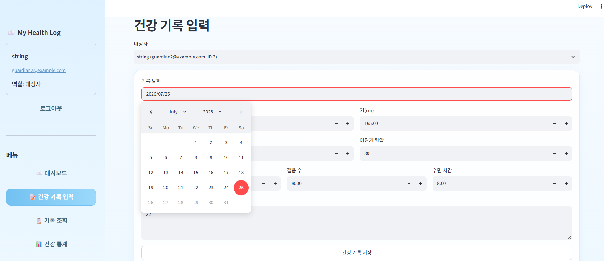
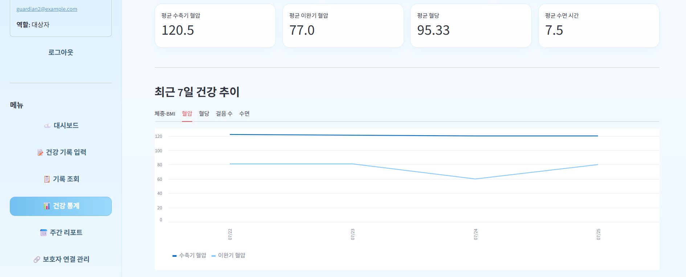
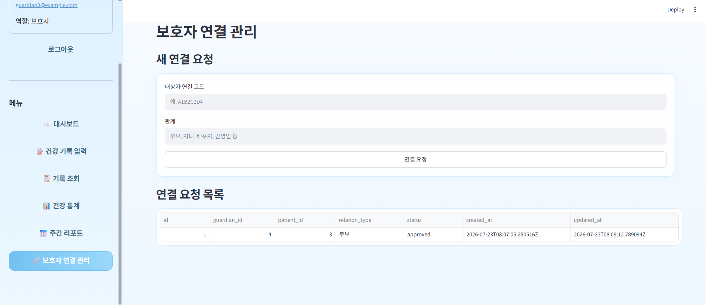

# ☁️ My Health Log

대상자, 보호자, 관리자가 역할별 권한에 따라 건강 기록을 입력하고 관리하는 웹 서비스입니다.

FastAPI와 PostgreSQL로 건강 기록 API를 구현하고, Streamlit으로 실제 사용자 화면을 구성했습니다. Docker Compose를 통해 로컬과 AWS Lightsail에서 동일한 구조로 실행할 수 있습니다.

---

## 주요 기능

- JWT 기반 회원가입 및 로그인
- 대상자·보호자·관리자 역할 분리
- 건강 기록 생성·조회·수정·삭제
- 보호자 연결 요청 및 대상자 승인
- 역할 기반 건강 데이터 접근 제어
- BMI 자동 계산 및 상태 분류
- 혈압·혈당 상태 자동 분류
- 걸음 수 등급과 건강 경고 생성
- 대상자별 평균 건강 통계
- 최근 7일 건강 기록 추이 그래프
- 최근 7일과 직전 7일 비교 리포트
- 미래 날짜 입력 차단
- 건강 수치 최소·최대 범위 검증
- 하늘색·흰색 기반 Streamlit UI
- Docker Compose 실행
- AWS Lightsail 배포

---

## 사용자 역할

| 역할 | 주요 기능 |
|---|---|
| 대상자 | 본인 기록 관리, 보호자 연결 승인, 통계·그래프·리포트 확인 |
| 보호자 | 대상자 연결 요청, 승인된 대상자의 기록 관리 |
| 관리자 | 전체 사용자와 모든 대상자의 기록 조회 및 관리 |

---

## 기술 스택

### Backend

- Python
- FastAPI
- Pydantic
- SQLAlchemy
- JWT
- pwdlib
- PyJWT

### Frontend

- Streamlit
- Requests
- Pandas

### Database

- PostgreSQL 17

### Infrastructure

- Docker
- Docker Compose
- AWS Lightsail

---

## 시스템 구성

```text
사용자 브라우저
      │
      ▼
Streamlit Frontend :8501
      │
      ▼
FastAPI Backend :8000
      │
      ▼
PostgreSQL Database :5432
```

외부에서는 FastAPI를 호스트의 9090번 포트로 공개합니다.

---

## 프로젝트 구조

```text
my-health-log-api
├─ app
│  ├─ create_admin.py
│  ├─ crud.py
│  ├─ database.py
│  ├─ health_service.py
│  ├─ main.py
│  ├─ models.py
│  ├─ schemas.py
│  └─ security.py
│
├─ frontend
│  ├─ .streamlit
│  │  └─ config.toml
│  ├─ app.py
│  ├─ Dockerfile
│  └─ requirements.txt
│
├─ docs
│  ├─ erd.md
│  └─ prd.md
│
├─ docker-compose.yml
├─ Dockerfile
├─ README.md
└─ requirements.txt
```

---

## 데이터베이스

핵심 테이블은 다음 세 개입니다.

- `users`: 대상자, 보호자, 관리자 계정
- `guardian_patient_links`: 보호자와 대상자의 연결 관계
- `health_records`: 건강 측정값과 자동 분석 결과

자세한 내용은 [`docs/erd.md`](docs/erd.md)를 참고합니다.

---

## 입력값 검증

| 항목 | 허용 범위 |
|---|---:|
| 기록 날짜 | 오늘 또는 과거 |
| 체중 | 20~300kg |
| 키 | 50~250cm |
| 수축기 혈압 | 60~250 |
| 이완기 혈압 | 30~150 |
| 공복 혈당 | 40~500mg/dL |
| 걸음 수 | 0~100,000 |
| 수면 시간 | 0~24시간 |
| 메모 | 최대 500자 |

수축기 혈압은 이완기 혈압보다 높아야 합니다.

입력값은 Streamlit에서 1차 검증하고 FastAPI에서 2차 검증합니다. 범위를 벗어난 데이터는 데이터베이스에 저장되지 않습니다.

---

## 주요 API

| Method | Endpoint | 설명 |
|---|---|---|
| POST | `/auth/register` | 회원가입 |
| POST | `/auth/login` | 로그인 |
| GET | `/users/me` | 현재 사용자 정보 |
| GET | `/users` | 전체 사용자 조회 |
| GET | `/users/accessible-patients` | 접근 가능한 대상자 목록 |
| POST | `/records` | 건강 기록 생성 |
| GET | `/records` | 건강 기록 목록 조회 |
| GET | `/records/{record_id}` | 건강 기록 단건 조회 |
| PUT | `/records/{record_id}` | 건강 기록 수정 |
| DELETE | `/records/{record_id}` | 건강 기록 삭제 |
| GET | `/search` | 기간별 기록 검색 |
| GET | `/stats` | 건강 통계 조회 |
| GET | `/weekly-report` | 주간 리포트 조회 |
| POST | `/guardian-links` | 보호자 연결 요청 |
| GET | `/guardian-links` | 연결 요청 목록 조회 |
| PATCH | `/guardian-links/{link_id}/status` | 연결 승인·거절 |

전체 API는 Swagger에서 확인할 수 있습니다.

---

## 환경변수

루트 경로에 `.env` 파일을 생성합니다.

```env
POSTGRES_DB=health_log_db
POSTGRES_USER=health_user
POSTGRES_PASSWORD=change_this_password
POSTGRES_HOST=db
POSTGRES_PORT=5432

JWT_SECRET_KEY=change_this_to_a_long_random_secret
JWT_ALGORITHM=HS256
ACCESS_TOKEN_EXPIRE_MINUTES=60
```

실제 비밀번호와 JWT 비밀키가 포함된 `.env`는 Git에 업로드하지 않습니다. 저장소에는 예시값만 포함한 `.env.example`을 둡니다.

---

## 로컬 실행

### 1. 저장소 복제

```bash
git clone https://github.com/i-dab-i/my-health-log-api.git
cd my-health-log-api
```

### 2. 환경변수 설정

`.env.example`을 참고해 `.env`를 작성합니다.

### 3. 전체 서비스 실행

```bash
docker compose up -d --build
```

### 4. 상태 확인

```bash
docker compose ps
```

정상 실행 시 다음 세 컨테이너가 표시됩니다.

```text
health-log-db
health-log-api
health-log-frontend
```

---

## 로컬 접속 주소

| 서비스 | 주소 |
|---|---|
| Streamlit 사용자 화면 | http://localhost:8501 |
| FastAPI Swagger | http://localhost:9090/docs |
| OpenAPI JSON | http://localhost:9090/openapi.json |

---

## 관리자 계정 생성

관리자 계정은 일반 회원가입 화면에서 생성하지 않습니다.

```bash
docker compose exec api python -m app.create_admin
```

실행 후 관리자 이메일, 이름, 비밀번호를 입력합니다. 비밀번호 입력 시 터미널에 문자가 표시되지 않는 것이 정상입니다.

---

## 보호자 연결 절차

```text
1. 대상자가 회원가입한다.
2. 대상자 대시보드에서 연결 코드를 확인한다.
3. 보호자에게 연결 코드를 전달한다.
4. 보호자가 대상자 코드로 연결을 요청한다.
5. 대상자가 요청을 승인한다.
6. 보호자가 대상자의 건강 기록에 접근한다.
```

연결 상태가 `approved`가 되기 전에는 보호자가 대상자의 건강 기록에 접근할 수 없습니다.

---

## 역할별 접근 권한

| 기능 | 대상자 | 보호자 | 관리자 |
|---|---|---|---|
| 본인 기록 조회 | 가능 | - | 가능 |
| 승인 대상자 기록 조회 | 불가 | 가능 | 가능 |
| 건강 기록 입력 | 본인 | 승인 대상자 | 모든 대상자 |
| 건강 기록 수정·삭제 | 본인 | 승인 대상자 | 모든 대상자 |
| 보호자 연결 요청 | 불가 | 가능 | 불가 |
| 연결 승인·거절 | 가능 | 불가 | 가능 |
| 전체 사용자 조회 | 불가 | 불가 | 가능 |
| 통계 및 리포트 | 본인 | 승인 대상자 | 모든 대상자 |

---

## AWS 배포

### 배포 주소

| 서비스 | 주소 |
|---|---|
| Streamlit 사용자 화면 | http://13.124.215.0:8501 |
| FastAPI Swagger | http://13.124.215.0:9090/docs |

### 서버 코드 업데이트

```bash
cd ~/my-health-log-api
git pull origin main
docker compose up -d --build api frontend
```

일반 업데이트 과정에서는 PostgreSQL 데이터를 유지하기 위해 `docker compose down -v`를 사용하지 않습니다.

---

## 코드 검사

### 백엔드

```bash
python -m compileall app
```

### 프런트엔드

```bash
python -m py_compile frontend/app.py
```

### Docker Compose

```bash
docker compose config
```

---

## 테스트 항목

- 대상자·보호자 회원가입 및 로그인
- 관리자 로그인
- 건강 기록 생성·조회·수정·삭제
- 미래 날짜 저장 차단
- 건강 수치 범위 초과 저장 차단
- 수축기·이완기 혈압 관계 검증
- 보호자 연결 요청 및 승인
- 승인되지 않은 대상자의 기록 접근 차단
- 대상자별 통계 조회
- 최근 7일 그래프 표시
- 주간 비교 리포트 표시
- 관리자 전체 사용자 목록 조회
- AWS 배포 주소 접속

---

## 화면 디자인

- 하늘색과 흰색 기반 클라우드 테마
- 역할별 사이드바 메뉴
- 선택된 메뉴 색상 강조
- 카드형 건강 통계
- 건강 기록 표
- 최근 7일 추이 그래프
- 사용자용 주간 비교 리포트
- 입력값 오류 메시지 표시

---

## 문서

- [PRD](docs/prd.md)
- [ERD](docs/erd.md)
- [Swagger API 문서](http://13.124.215.0:9090/docs)

---

## 실행 화면

대상자 건강 기록



최근 7일 건강 추이 및 리포트



보호자 연결 관리



---

## 보안 주의 사항

- `.env` 파일을 Git에 업로드하지 않습니다.
- JWT 비밀키를 README나 화면 캡처에 공개하지 않습니다.
- 실제 DB 비밀번호를 저장소에 작성하지 않습니다.
- 액세스 토큰을 외부에 공유하지 않습니다.
- 운영 환경에서는 HTTPS와 도메인 적용을 권장합니다.
