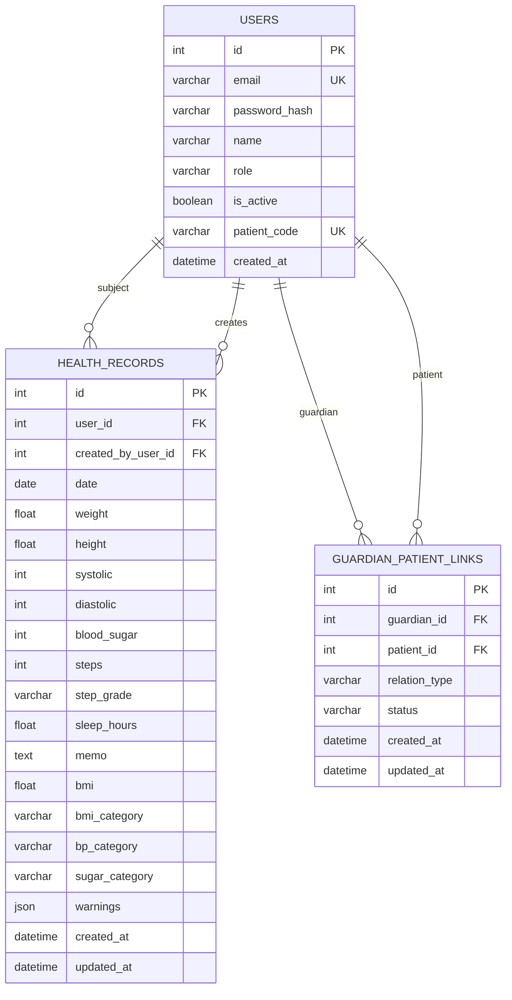

# 마이 헬스 로그 API ERD

## 사용자 역할

| 역할 | 설명 |
|---|---|
| `patient` | 자신의 건강 기록을 관리하는 대상자 |
| `guardian` | 승인된 대상자의 건강 기록을 조회·등록하는 보호자 |
| `admin` | 전체 사용자와 건강 기록을 조회·관리하는 관리자 |

## 보호자·대상자 관계

`guardian_patient_links`는 보호자와 대상자를 연결하는 다대다 관계 테이블이다.

- 보호자 한 명이 여러 대상자와 연결될 수 있다.
- 대상자 한 명이 여러 보호자와 연결될 수 있다.
- 동일한 보호자·대상자 조합은 한 번만 저장된다.
- 연결 상태는 `pending`, `approved`, `rejected` 중 하나다.

## 건강 기록 소유자와 작성자

- `health_records.user_id`: 건강 기록의 실제 대상자
- `health_records.created_by_user_id`: 기록을 입력한 사용자

대상자가 직접 입력하면 두 값은 동일하다.

보호자가 대신 입력하면 `user_id`와 `created_by_user_id`가 서로 다르다.

## 주간 리포트

주간 리포트는 별도 테이블에 저장하지 않는다. `health_records` 데이터를 기간별로 조회하여 최근 7일과 직전 7일의 평균을 계산한다.