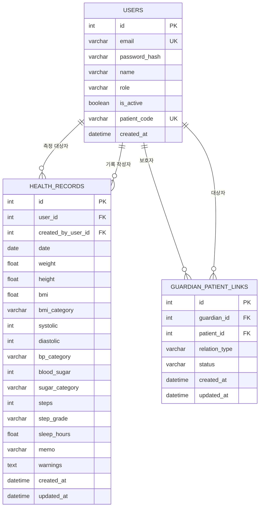

# My Health Log ERD

## 1. 데이터베이스 개요

My Health Log는 다음 세 개의 핵심 테이블로 구성된다.

- `users`: 대상자, 보호자, 관리자 계정
- `guardian_patient_links`: 보호자와 대상자의 연결 관계
- `health_records`: 대상자의 건강 측정 기록과 자동 분석 결과

보호자와 대상자는 `guardian_patient_links`를 통해 다대다 관계를 형성한다.

---

## 2. ERD



---

## 3. 테이블 정의

### 3.1 `users`

대상자, 보호자, 관리자 계정을 하나의 테이블에서 관리한다.

| 컬럼 | 키 | 설명 |
|---|---|---|
| `id` | PK | 사용자 고유 ID |
| `email` | UK | 로그인 이메일 |
| `password_hash` |  | 해시 처리된 비밀번호 |
| `name` |  | 사용자 이름 |
| `role` |  | `patient`, `guardian`, `admin` |
| `is_active` |  | 계정 활성 상태 |
| `patient_code` | UK | 보호자 연결용 대상자 코드 |
| `created_at` |  | 계정 생성 시각 |

`patient_code`는 대상자 계정에 발급된다. 보호자와 관리자 계정에는 일반적으로 값이 없다.

---

### 3.2 `guardian_patient_links`

보호자와 대상자의 연결 요청과 승인 상태를 관리한다.

| 컬럼 | 키 | 설명 |
|---|---|---|
| `id` | PK | 연결 고유 ID |
| `guardian_id` | FK | 보호자 사용자 ID |
| `patient_id` | FK | 대상자 사용자 ID |
| `relation_type` |  | 부모, 자녀, 배우자, 간병인 등의 관계 |
| `status` |  | `pending`, `approved`, `rejected` |
| `created_at` |  | 연결 요청 생성 시각 |
| `updated_at` |  | 상태 변경 시각 |

`guardian_id`와 `patient_id`의 조합은 중복되지 않도록 제한한다.

---

### 3.3 `health_records`

건강 측정값과 자동 계산·분류 결과를 저장한다.

| 컬럼 | 키 | 설명 |
|---|---|---|
| `id` | PK | 건강 기록 고유 ID |
| `user_id` | FK | 건강 기록의 대상자 ID |
| `created_by_user_id` | FK | 기록을 실제로 입력한 사용자 ID |
| `date` |  | 건강 측정일 |
| `weight` |  | 체중(kg) |
| `height` |  | 키(cm) |
| `bmi` |  | 자동 계산된 BMI |
| `bmi_category` |  | BMI 분류 |
| `systolic` |  | 수축기 혈압 |
| `diastolic` |  | 이완기 혈압 |
| `bp_category` |  | 혈압 분류 |
| `blood_sugar` |  | 공복 혈당 |
| `sugar_category` |  | 혈당 분류 |
| `steps` |  | 걸음 수 |
| `step_grade` |  | 걸음 수 등급 |
| `sleep_hours` |  | 수면 시간 |
| `memo` |  | 사용자 메모 |
| `warnings` |  | 자동 생성된 건강 경고 |
| `created_at` |  | 기록 생성 시각 |
| `updated_at` |  | 기록 수정 시각 |

---

## 4. 관계 설명

### 대상자와 건강 기록

한 명의 대상자는 여러 건강 기록을 가질 수 있다.

```text
users.id → health_records.user_id
```

### 기록 작성자와 건강 기록

대상자 본인, 승인된 보호자 또는 관리자가 건강 기록을 작성할 수 있다.

```text
users.id → health_records.created_by_user_id
```

`user_id`는 기록의 주인을, `created_by_user_id`는 실제 입력자를 의미한다.

### 보호자와 대상자

보호자와 대상자는 연결 테이블을 통한 다대다 관계이다.

```text
users.id → guardian_patient_links.guardian_id
users.id → guardian_patient_links.patient_id
```

보호자는 연결 상태가 `approved`인 대상자의 건강 기록에 접근할 수 있다.

---

## 5. 입력값 검증 규칙

| 항목 | 허용 범위 또는 조건 |
|---|---|
| 기록 날짜 | 오늘 또는 과거 |
| 체중 | 20~300kg |
| 키 | 50~250cm |
| 수축기 혈압 | 60~250 |
| 이완기 혈압 | 30~150 |
| 혈압 관계 | 수축기 혈압 > 이완기 혈압 |
| 공복 혈당 | 40~500mg/dL |
| 걸음 수 | 0~100,000 |
| 수면 시간 | 0~24시간 |
| 메모 | 최대 500자 |

Streamlit에서 1차 검증하고 FastAPI의 Pydantic 스키마에서 2차 검증한다. 검증에 실패한 요청은 데이터베이스에 저장되지 않는다.
