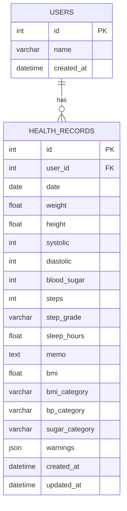

# 마이 헬스 로그 API ERD

## 테이블 관계

한 명의 사용자는 여러 개의 건강 기록을 가질 수 있다.

## users

| 컬럼 | 자료형 | 제약조건 | 설명 |
|---|---|---|---|
| id | Integer | PK, Auto Increment | 사용자 식별자 |
| name | Varchar(100) | NOT NULL | 사용자 이름 |
| created_at | DateTime | NOT NULL | 사용자 생성 시각 |

## health_records

| 컬럼 | 자료형 | 제약조건 | 설명 |
|---|---|---|---|
| id | Integer | PK, Auto Increment | 건강 기록 식별자 |
| user_id | Integer | FK, NOT NULL | 사용자 식별자 |
| date | Date | NOT NULL | 건강 측정일 |
| weight | Float | NOT NULL | 몸무게(kg) |
| height | Float | NOT NULL | 키(cm) |
| systolic | Integer | NOT NULL | 수축기 혈압 |
| diastolic | Integer | NOT NULL | 이완기 혈압 |
| blood_sugar | Integer | NOT NULL | 공복 혈당 |
| steps | Integer | 기본값 0 | 걸음 수 |
| step_grade | Varchar(20) | NOT NULL | 걸음 수 등급 |
| sleep_hours | Float | 기본값 0 | 수면 시간 |
| memo | Text | 기본값 빈 문자열 | 사용자 메모 |
| bmi | Float | NOT NULL | 계산된 BMI |
| bmi_category | Varchar(20) | NOT NULL | BMI 분류 |
| bp_category | Varchar(20) | NOT NULL | 혈압 분류 |
| sugar_category | Varchar(20) | NOT NULL | 혈당 분류 |
| warnings | JSON | 기본값 빈 배열 | 건강 경고 목록 |
| created_at | DateTime | NOT NULL | 생성 시각 |
| updated_at | DateTime | NOT NULL | 수정 시각 |

## 설계 원칙

- 사용자 한 명은 여러 건강 기록을 가진다.
- 사용자 삭제 시 해당 사용자의 건강 기록도 함께 삭제한다.
- BMI와 각 건강 분류는 FastAPI에서 계산한 뒤 DB에 저장한다.
- 주간 리포트는 별도 테이블에 저장하지 않고 `health_records`를 조회해 계산한다.
- 걸음 수 등급은 건강 기록을 등록하거나 수정할 때 다시 계산한다.